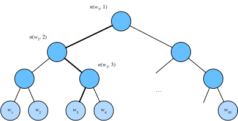

# 词嵌入：word2vec

自然语言是一套用来表达含义的复杂系统。在这套系统中，词是表义的基本单元。顾名思义，词向量是用来表示词的向量，也可被认为是词的特征向量。这通常需要把维数为词典大小的高维空间嵌入到一个更低维数的连续向量空间。把词映射为实数域上向量的技术也叫词嵌入（word embedding）。近年来，词嵌入已逐渐成为自然语言处理的基础知识。那么，我们应该如何使用向量表示词呢？

## 为何不采用one-hot向量

我们在[“循环神经网络”](../chapter_recurrent-neural-networks/rnn.md)一节中使用one-hot向量表示词（字符为词）。回忆一下，假设词典中不同词的数量（词典大小）为$N$，每个词可以和从0到$N-1$的连续整数一一对应。这些与词对应的整数也叫词的索引。
假设一个词的索引为$i$，为了得到该词的one-hot向量表示，我们创建一个全0的长为$N$的向量，并将其第$i$位设成1。

然而，使用one-hot词向量通常并不是一个好选择。一个主要的原因是，one-hot词向量无法表达不同词之间的相似度，例如余弦相似度。由于任意一对向量$\boldsymbol{x}, \boldsymbol{y} \in \mathbb{R}^d$的余弦相似度为

$$\frac{\boldsymbol{x}^\top \boldsymbol{y}}{\|\boldsymbol{x}\| \|\boldsymbol{y}\|} \in [-1, 1] ,$$

任何一对词的one-hot向量的余弦相似度都为0。

## word2vec

2013年，Google团队发表了word2vec工具 [1]。word2vec工具主要包含两个模型：跳字模型（skip-gram）和连续词袋模型（continuous bag of words，简称CBOW），以及两种近似训练法：负采样（negative sampling）和层序softmax（hierarchical softmax）。值得一提的是，word2vec的词向量可以较好地表达不同词之间的相似和类比关系。

word2vec自提出后被广泛应用在自然语言处理任务中。它的模型和训练方法也启发了很多后续的词嵌入模型。本节将重点介绍word2vec的模型和训练方法。

## 模型

word2vec工具主要包含跳字模型和连续词袋模型。下面将分别介绍它们。

### 跳字模型

在跳字模型中，我们用一个词来预测它在文本序列周围的词。举个例子，假设文本序列是“the”、“man”、“loves”、“his”和“son”。以“loves”作为中心词，设时间窗口大小为2。跳字模型所关心的是，给定中心词“loves”生成与它距离不超过2个词的背景词“the”、“man”、“his”和“son”的条件概率。

我们来描述一下跳字模型。

假设词典索引集$\mathcal{V}$的大小为$|\mathcal{V}|$，且$\mathcal{V} = \{0, 1, \ldots, |\mathcal{V}|-1\}$。给定一个长度为$T$的文本序列中，时间步$t$的词为$w^{(t)}$。当时间窗口大小为$m$时，跳字模型需要最大化给定任一中心词生成所有背景词的概率

$$ \prod_{t=1}^T \prod_{-m \leq j \leq m, j \neq 0} \mathbb{P}(w^{(t+j)} \mid w^{(t)}).$$

上式的最大似然估计与最小化以下损失函数等价：

$$ -\frac{1}{T} \sum_{t=1}^T \sum_{-m \leq j \leq m, j \neq 0} \text{log} \mathbb{P}(w^{(t+j)} \mid w^{(t)}).$$

我们可以用$\mathbf{v}$和$\mathbf{u}$分别表示中心词和背景词的向量。换言之，对于词典中索引为$i$的词，它在作为中心词和背景词时的向量表示分别是$\mathbf{v}_i$和$\mathbf{u}_i$。而词典中所有词的这两种向量正是跳字模型所要学习的模型参数。为了将模型参数植入损失函数，我们需要使用模型参数表达损失函数中的给定中心词生成背景词的条件概率。给定中心词，假设生成各个背景词是相互独立的。设中心词$w_c$在词典中索引为$c$，背景词$w_o$在词典中索引为$o$，损失函数中的给定中心词生成背景词的条件概率可以通过softmax函数定义为

$$\mathbb{P}(w_o \mid w_c) = \frac{\text{exp}(\mathbf{u}_o^\top \mathbf{v}_c)}{ \sum_{i \in \mathcal{V}} \text{exp}(\mathbf{u}_i^\top \mathbf{v}_c)}.$$

当序列长度$T$较大时，我们通常在每次迭代时随机采样一个较短的子序列来计算有关该子序列的损失。然后，根据该损失计算词向量的梯度并迭代词向量。具体算法可以参考[“梯度下降和随机梯度下降”](../chapter_optimization/gd-sgd.md)一节。
作为一个具体的例子，下面我们看看如何计算随机采样的子序列的损失有关中心词向量的梯度。和上面提到的长度为$T$的文本序列的损失函数类似，随机采样的子序列的损失实际上是对子序列中给定中心词生成背景词的条件概率的对数求平均。通过微分，我们可以得到上式中条件概率的对数有关中心词向量$\mathbf{v}_c$的梯度

$$\frac{\partial \text{log} \mathbb{P}(w_o \mid w_c)}{\partial \mathbf{v}_c} = \mathbf{u}_o - \sum_{j \in \mathcal{V}} \frac{\text{exp}(\mathbf{u}_j^\top \mathbf{v}_c)}{ \sum_{i \in \mathcal{V}} \text{exp}(\mathbf{u}_i^\top \mathbf{v}_c)} \mathbf{u}_j.$$

该式也可写作

$$\frac{\partial \text{log} \mathbb{P}(w_o \mid w_c)}{\partial \mathbf{v}_c} = \mathbf{u}_o - \sum_{j \in \mathcal{V}} \mathbb{P}(w_j \mid w_c) \mathbf{u}_j.$$

随机采样的子序列有关其他词向量的梯度同理可得。训练模型时，每一次迭代实际上是用这些梯度来迭代子序列中出现过的中心词和背景词的向量。训练结束后，对于词典中的任一索引为$i$的词，我们均得到该词作为中心词和背景词的两组词向量$\mathbf{v}_i$和$\mathbf{u}_i$。在自然语言处理应用中，我们会使用跳字模型的中心词向量。

### 连续词袋模型

连续词袋模型与跳字模型类似。与跳字模型最大的不同是，连续词袋模型用一个中心词在文本序列前后的背景词来预测该中心词。举个例子，假设文本序列为“the”、 “man”、“loves”、“his”和“son”。以“loves”作为中心词，设时间窗口大小为2。连续词袋模型所关心的是，给定与中心词距离不超过2个词的背景词“the”、“man”、“his”和“son”生成中心词“loves”的条件概率。

假设词典索引集$\mathcal{V}$的大小为$|\mathcal{V}|$，且$\mathcal{V} = \{0, 1, \ldots, |\mathcal{V}|-1\}$。给定一个长度为$T$的文本序列中，时间步$t$的词为$w^{(t)}$。当时间窗口大小为$m$时，连续词袋模型需要最大化由背景词生成任一中心词的概率

$$ \prod_{t=1}^T  \mathbb{P}(w^{(t)} \mid  w^{(t-m)}, \ldots,  w^{(t-1)},  w^{(t+1)}, \ldots,  w^{(t+m)}).$$

上式的最大似然估计与最小化以下损失函数等价：

$$  -\sum_{t=1}^T  \text{log} \mathbb{P}(w^{(t)} \mid  w^{(t-m)}, \ldots,  w^{(t-1)},  w^{(t+1)}, \ldots,  w^{(t+m)}).$$

我们可以用$\mathbf{v}$和$\mathbf{u}$分别表示背景词和中心词的向量（注意符号和跳字模型中的不同）。换言之，对于词典中索引为$i$的词，它在作为背景词和中心词时的向量表示分别是$\mathbf{v}_i$和$\mathbf{u}_i$。而词典中所有词的这两种向量正是连续词袋模型所要学习的模型参数。为了将模型参数植入损失函数，我们需要使用模型参数表达损失函数中的给定背景词生成中心词的概率。设中心词$w_c$在词典中索引为$c$，背景词$w_{o_1}, \ldots, w_{o_{2m}}$在词典中索引为$o_1, \ldots, o_{2m}$，损失函数中的给定背景词生成中心词的概率可以通过softmax函数定义为

$$\mathbb{P}(w_c \mid w_{o_1}, \ldots, w_{o_{2m}}) = \frac{\text{exp}\left(\mathbf{u}_c^\top (\mathbf{v}_{o_1} + \ldots + \mathbf{v}_{o_{2m}}) /(2m) \right)}{ \sum_{i \in \mathcal{V}} \text{exp}\left(\mathbf{u}_i^\top (\mathbf{v}_{o_1} + \ldots + \mathbf{v}_{o_{2m}}) /(2m) \right)}.$$

和跳字模型一样，当序列长度$T$较大时，我们通常在每次迭代时随机采样一个较短的子序列来计算有关该子序列的损失。然后，根据该损失计算词向量的梯度并迭代词向量。
通过微分，我们可以计算出上式中条件概率的对数有关任一背景词向量$\mathbf{v}_{o_i}$($i = 1, \ldots, 2m$)的梯度为：

$$\frac{\partial \text{log} \mathbb{P}(w_c \mid w_{o_1}, \ldots, w_{o_{2m}})}{\partial \mathbf{v}_{o_i}} = \frac{1}{2m} \left(\mathbf{u}_c - \sum_{j \in \mathcal{V}} \frac{\text{exp}(\mathbf{u}_j^\top \mathbf{v}_c)}{ \sum_{i \in \mathcal{V}} \text{exp}(\mathbf{u}_i^\top \mathbf{v}_c)} \mathbf{u}_j \right).$$

该式也可写作

$$\frac{\partial \text{log} \mathbb{P}(w_c \mid w_{o_1}, \ldots, w_{o_{2m}})}{\partial \mathbf{v}_{o_i}} = \frac{1}{2m}\left(\mathbf{u}_c - \sum_{j \in \mathcal{V}} \mathbb{P}(w_j \mid w_c) \mathbf{u}_j\right).$$

随机采样的子序列有关其他词向量的梯度同理可得。和跳字模型一样，训练结束后，对于词典中的任一索引为$i$的词，我们均得到该词作为背景词和中心词的两组词向量$\mathbf{v}_i$和$\mathbf{u}_i$。在自然语言处理应用中，我们会使用连续词袋模型的背景词向量。

## 近似训练法

我们可以看到，无论是跳字模型还是连续词袋模型，每一步梯度计算的开销与词典$\mathcal{V}$的大小相关。当词典较大时，例如几十万到上百万，这种训练方法的计算开销会较大。因此，我们将使用近似的方法来计算这些梯度，从而减小计算开销。常用的近似训练法包括负采样和层序softmax。

### 负采样

我们以跳字模型为例讨论负采样。

实际上，词典$\mathcal{V}$的大小之所以会在损失中出现，是因为给定中心词$w_c$生成背景词$w_o$的条件概率$\mathbb{P}(w_o \mid w_c)$使用了softmax运算，而softmax运算正是考虑了背景词可能是词典中的任一词，并体现在分母上。

不妨换个角度考虑给定中心词生成背景词的条件概率。我们先定义噪声词分布$\mathbb{P}(w)$，接着假设给定中心词$w_c$生成背景词$w_o$由以下相互独立事件联合组成来近似：

* 中心词$w_c$和背景词$w_o$同时出现时间窗口。
* 中心词$w_c$和第1个噪声词$w_1$不同时出现在该时间窗口（噪声词$w_1$按噪声词分布$\mathbb{P}(w)$随机生成，且假设不为背景词$w_o$）。
* ...
* 中心词$w_c$和第$K$个噪声词$w_K$不同时出现在该时间窗口（噪声词$w_K$按噪声词分布$\mathbb{P}(w)$随机生成，且假设不为背景词$w_o$）。

下面，我们可以使用$\sigma(x) = 1/(1+\text{exp}(-x))$函数来表达中心词$w_c$和背景词$w_o$同时出现在该训练数据窗口的概率：

$$\mathbb{P}(D = 1 \mid w_o, w_c) = \sigma(\mathbf{u}_o^\top \mathbf{v}_c).$$

那么，给定中心词$w_c$生成背景词$w_o$的条件概率的对数可以近似为

$$ \text{log} \mathbb{P} (w_o \mid w_c) = \text{log} \left(\mathbb{P}(D = 1 \mid w_o, w_c) \prod_{k=1, w_k \sim \mathbb{P}(w)}^K \mathbb{P}(D = 0 \mid w_k, w_c) \right).$$

假设噪声词$w_k$在词典中的索引为$i_k$，上式可改写为

$$ \text{log} \mathbb{P} (w_o \mid w_c) = \text{log} \frac{1}{1+\text{exp}(-\mathbf{u}_o^\top \mathbf{v}_c)}  + \sum_{k=1, w_k \sim \mathbb{P}(w)}^K \text{log} \left(1-\frac{1}{1+\text{exp}(-\mathbf{u}_{i_k}^\top \mathbf{v}_c)}\right). $$

因此，有关给定中心词$w_c$生成背景词$w_o$的损失是

$$ - \text{log} \mathbb{P} (w_o \mid w_c) = -\text{log} \frac{1}{1+\text{exp}(-\mathbf{u}_o^\top \mathbf{v}_c)}  - \sum_{k=1, w_k \sim \mathbb{P}(w)}^K \text{log} \frac{1}{1+\text{exp}(\mathbf{u}_{i_k}^\top \mathbf{v}_c)}. $$

假设词典$\mathcal{V}$很大，每次迭代的计算开销由$\mathcal{O}(|\mathcal{V}|)$变为$\mathcal{O}(K)$。当我们把$K$取较小值时，负采样每次迭代的计算开销将较小。

当然，我们也可以对连续词袋模型进行负采样。有关给定背景词$w^{(t-m)}, \ldots,  w^{(t-1)},  w^{(t+1)}, \ldots,  w^{(t+m)}$生成中心词$w_c$的损失

$$-\text{log} \mathbb{P}(w^{(t)} \mid  w^{(t-m)}, \ldots,  w^{(t-1)},  w^{(t+1)}, \ldots,  w^{(t+m)})$$

在负采样中可以近似为

$$-\text{log} \frac{1}{1+\text{exp}\left(-\mathbf{u}_c^\top (\mathbf{v}_{o_1} + \ldots + \mathbf{v}_{o_{2m}}) /(2m)\right)}  - \sum_{k=1, w_k \sim \mathbb{P}(w)}^K \text{log} \frac{1}{1+\text{exp}\left((\mathbf{u}_{i_k}^\top (\mathbf{v}_{o_1} + \ldots + \mathbf{v}_{o_{2m}}) /(2m)\right)}.$$

同样，当我们把$K$取较小值时，负采样每次迭代的计算开销将较小。

## 层序softmax

层序softmax是另一种常用的近似训练法。它利用了二叉树这一数据结构。树的每个叶子节点代表着词典$\mathcal{V}$中的每个词。我们以图10.1为例来描述层序softmax的工作机制。

假设$L(w)$为从二叉树的根节点到词$w$的叶子节点的路径（包括根和叶子节点）上的节点数。设$n(w,j)$为该路径上第$j$个节点，并设该节点的向量为$\mathbf{u}_{n(w,j)}$。以图10.1为例，$L(w_3) = 4$。设词典中的词$w_i$的词向量为$\mathbf{v}_i$。那么，跳字模型和连续词袋模型所需要计算的给定词$w_i$生成词$w$的条件概率为：

$$\mathbb{P}(w \mid w_i) = \prod_{j=1}^{L(w)-1} \sigma\left( [\![  n(w, j+1) = \text{leftChild}(n(w,j)) ]\!] \cdot \mathbf{u}_{n(w,j)}^\top \mathbf{v}_i\right),$$

其中$\sigma(x) = 1/(1+\text{exp}(-x))$，$\text{leftChild}(n)$是节点$n$的左孩子节点，如果判断$x$为真，$[\![x]\!] = 1$；反之$[\![x]\!] = -1$。由于$\sigma(x)+\sigma(-x) = 1$，给定词$w_i$生成词典$\mathcal{V}$中任一词的条件概率之和为1这一条件也将满足：

$$\sum_{w \in \mathcal{V}} \mathbb{P}(w \mid w_i) = 1.$$

让我们计算图10.1中给定词$w_i$生成词$w_3$的条件概率。我们需要将$w_i$的词向量$\mathbf{v}_i$和根节点到$w_3$路径上的非叶子节点向量一一求内积。由于在二叉树中由根节点到叶子节点$w_3$的路径上需要向左、向右、再向左地遍历（图10.1中加粗的路径），我们得到

$$\mathbb{P}(w_3 \mid w_i) = \sigma(\mathbf{u}_{n(w_3,1)}^\top \mathbf{v}_i) \cdot \sigma(-\mathbf{u}_{n(w_3,2)}^\top \mathbf{v}_i) \cdot \sigma(\mathbf{u}_{n(w_3,3)}^\top \mathbf{v}_i).$$

在使用softmax的跳字模型和连续词袋模型中，词向量和二叉树中非叶子节点向量是需要学习的模型参数。假设词典$\mathcal{V}$很大，每次迭代的计算开销由$\mathcal{O}(|\mathcal{V}|)$下降至$\mathcal{O}(\text{log}_2|\mathcal{V}|)$。

## 小结

* 词向量是用于表示自然语言中词的语义的向量。
* word2vec工具中的跳字模型和连续词袋模型通常使用近似训练法，例如负采样和层序softmax，从而减小训练的计算开销。

## 练习

* 噪声词采样概率$\mathbb{P}(w)$在实际中被建议设为$w$词频与总词频的比的3/4次方。这样做有什么好处？提示：想想$0.99^{3/4}$和$0.01^{3/4}$的大小。
* 一些"the"和"a"之类的英文高频词会对结果产生什么影响？该如何处理？提示：可参考word2vec论文第2.3节 [2]。
* 如何训练包括例如"new york"在内的词组向量？提示：可参考word2vec论文第4节 [2]。

## 参考文献

[1] word2vec工具. https://code.google.com/archive/p/word2vec/

[2] Mikolov, T., Sutskever, I., Chen, K., Corrado, G. S., & Dean, J. (2013). Distributed representations of words and phrases and their compositionality. In Advances in neural information processing systems (pp. 3111-3119).
